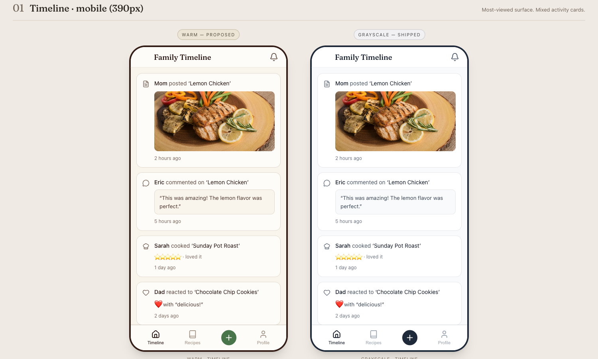
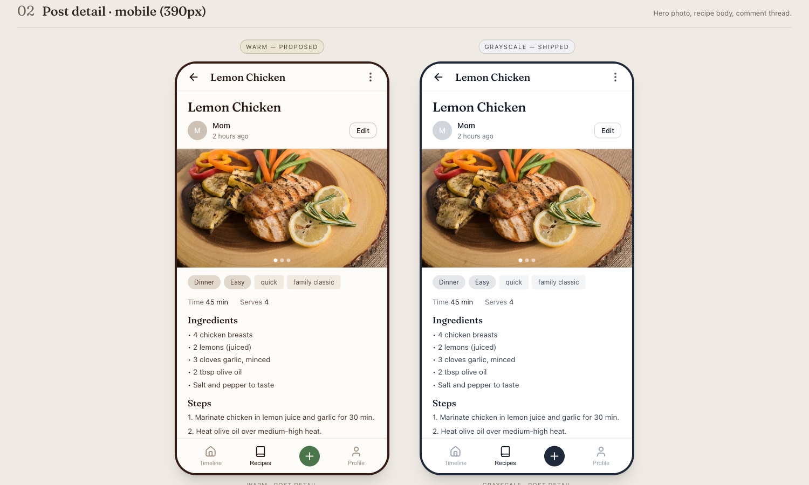

# Warm-cozy palette variant exploration

**Issue:** [#140 — research: warm-cozy palette variant exploration](https://github.com/wnorowskie/family-recipe/issues/140)
**Spike artifacts:** [docs/research/handoff-ui-warm-palette/](handoff-ui-warm-palette/) (Claude Design handoff bundle, including the live `Warm vs Grayscale Spike.html`)
**Mockups:** [docs/research/screenshots/ui-warm-palette-variant/](screenshots/ui-warm-palette-variant/)

## Decision

**Ship the warm variant as a user-toggleable theme. Default stays grayscale. Implementation tracked in the backlog — not a near-term priority.**

This matches Claude Design's own recommendation in the spike. The repo owner's read of the side-by-side mockups: warm reads as more inviting overall, and the post-detail integration with food photography is genuinely better. The timeline trade-off (warm chrome adds mood that the activity log doesn't strictly need) is real but small enough to leave to user preference rather than designer veto — which is exactly what a toggle is for.

Tracked as three sequential tickets in the backlog:

1. **[#153](https://github.com/wnorowskie/family-recipe/issues/153)** — `chore`: migrate hardcoded `gray-*` utilities to design-system tokens. **Prerequisite** for any theme swap; valuable on its own as design-system hygiene.
2. **[#154](https://github.com/wnorowskie/family-recipe/issues/154)** — `feat`: add the `[data-theme="warm"]` token block to `src/app/globals.css` and the missing `--focus-ring` token. Default theme unchanged; warm reachable via devtools.
3. **[#155](https://github.com/wnorowskie/family-recipe/issues/155)** — `feat`: persist user theme preference (`User.theme` column, `GET/PATCH /api/me/theme`, FastAPI mirror) and ship the Profile → Appearance toggle UI.

Order matters: #153 → #154 → #155. None are scheduled — they sit in the backlog until the active UI revamp ([#41](https://github.com/wnorowskie/family-recipe/issues/41)) finishes settling and the family has been on the new grayscale system long enough to evaluate it on its own terms.

---

## Mockups

Both pairs use identical typography, spacing, radii, components, and content — **only color tokens change**. The food photo (lemon chicken on a wood board) is the same image on both sides; what changes is the chrome around it.

### Pair 1 — Timeline (mobile, 390px)

The most-viewed surface. Mixed activity cards: posted-with-photo, comment, cooked-with-rating, reaction.

### Pair 2 — Post detail (mobile, 390px)

Hero photo, recipe body (chips, ingredients, steps), comment thread off-screen below.

The full spike (mockups + token diff + a11y notes + Claude Design's recommendation) is also captured as a single image at [`screenshots/ui-warm-palette-variant/spike-full.png`](screenshots/ui-warm-palette-variant/spike-full.png), and the live HTML is at [`handoff-ui-warm-palette/family-recipe-design-system/project/Warm vs Grayscale Spike.html`](handoff-ui-warm-palette/family-recipe-design-system/project/Warm%20vs%20Grayscale%20Spike.html) (serve the project dir over a static server — the file uses in-browser Babel + ESM React from unpkg).

---

## Answers to the ticket's questions

### 1. Better, or just different?

**Better overall, with a small trade-off on timeline.** Both perspectives recorded below since they informed the "ship as toggle, not as default" call.

**Timeline (Pair 1) — mixed read.** The timeline is a status surface — icon + verb + sometimes a photo + sometimes a quote + timestamp, repeated four times. The cool grayscale chrome arguably stays out of the way for pure scanning, and the grayscale near-black FAB reads as more confidently primary than the warm sage FAB. _But_ the warm chrome makes the whole surface feel more like a kitchen and less like a notification log — which matches the product's intent ("a cozy shared kitchen notebook, not a feed to perform on"). Reasonable readers will land on different sides of this trade-off; that's exactly the case for a user toggle.

**Post detail (Pair 2) — warm wins clearly.** The hero photo of the lemon chicken (warm wood board, peppers, lemon, golden-skinned chicken) sits _inside_ the warm chrome instead of being clamped between two cool gray bands; the photography belongs to the page. Fraunces in deep brown (`espresso-900`) genuinely looks better than Fraunces in cool near-black (`gray-900`) — it's a serif drawn for warm contexts.

The decision question wasn't "is warm a _valid_ alternative" (yes, clearly) but "is warm _meaningfully better_?" Two readers landed on slightly different answers — Claude's initial read was "modestly better on post detail, debatable on timeline, not enough delta to override default"; the repo owner's read was "warm is more inviting overall and matches the product intent better." A toggle resolves the disagreement without forcing one read on every user.

### 2. CSS-variable theme switch, or structural changes?

**CSS-variable swap. No primitive surgery required — but a hardcoded-gray cleanup sweep is a prerequisite.**

The warm variant in [`tokens.css`](handoff-ui-warm-palette/family-recipe-design-system/project/tokens.css) is a pure `[data-theme="warm"]` override on top of the existing semantic roles. Every change rides on the same eight roles the components already consume:

- `--bg-page`, `--bg-surface`, `--bg-muted`, `--bg-chip`, `--bg-primary`
- `--fg-strong`, `--fg-body`, `--fg-meta`, `--fg-caption`
- `--border-card`, `--border-input`, `--border-active`
- `--focus-ring` (currently a literal `oklch(0.708 0 0)` in the spike but not yet defined in [src/app/globals.css](../../src/app/globals.css) — would need to be added as a token first)

a11y math (verified by Claude Design in the spike, re-checked):

- Sage-500 focus ring on cream-50 surface ≈ 3.9:1 — clears WCAG AA's 3:1 floor for non-text UI components.
- Body text (brown-700) on cream-50 ≈ 9.8:1; headings (espresso-900) ≈ 14.1:1 — well above 4.5:1.
- White text on sage-500 primary button ≈ 4.7:1 — passes AA for normal text. Drops below 5:1 if button text shrinks under 14px; bump primary to sage-600 in that case.

**The catch — the prereq sweep.** Several shipped components hardcode Tailwind `gray-*` classes that bypass the token system, so a `[data-theme="warm"]` swap on `<html>` would re-theme some of the UI but not all of it. Audited via grep on the component tree:

| Component                                                                                                     | Hardcoded usage                                                                                               | Migration                                                                                |
| ------------------------------------------------------------------------------------------------------------- | ------------------------------------------------------------------------------------------------------------- | ---------------------------------------------------------------------------------------- |
| [src/components/navigation/NotificationBell.tsx:40](../../src/components/navigation/NotificationBell.tsx#L40) | `border-gray-200`, `text-gray-700`, `hover:bg-gray-50`, `outline-gray-900/40`                                 | swap to `var(--border-card)`, `var(--fg-body)`, `var(--bg-page)`, `var(--border-active)` |
| [src/components/timeline/TimelineFeed.tsx:67](../../src/components/timeline/TimelineFeed.tsx#L67)             | "Load more" button: `border-gray-300`, `text-gray-700`, `bg-white`, `hover:bg-gray-50`, `focus:ring-blue-500` | replace with `<Button variant="secondary">` from `src/components/ui`                     |
| [src/components/timeline/PostPreview.tsx:16,30](../../src/components/timeline/PostPreview.tsx#L16-L30)        | `bg-gray-50`, `hover:bg-gray-100`, `text-gray-900`                                                            | swap to `var(--bg-page)`, `var(--bg-muted)`, `var(--fg-strong)`                          |
| [src/components/timeline/EmptyState.tsx:7,22](../../src/components/timeline/EmptyState.tsx#L7-L22)            | `bg-gray-100`, `text-gray-900`                                                                                | swap to `var(--bg-muted)`, `var(--fg-strong)`                                            |

[src/components/timeline/TimelineCard.tsx:84](../../src/components/timeline/TimelineCard.tsx#L84) uses `bg-[var(--color-gray-200)]` — that's already token-driven (the warm theme also redefines `--color-gray-200`), so it's fine.

Estimated sweep: **~1.5–2 hours** for the four components above plus a verification pass. Worth doing for hygiene reasons regardless of whether the warm theme ever ships — these are technical-debt grep hits the design system spike already flagged.

### 3. Does the warmth survive user photos?

**Yes — and this is the strongest argument _for_ the warm variant.** The lemon-chicken hero in Pair 2 is the test: a warm-toned food photo (wood board, peppers, lemon yellow, golden chicken). Against grayscale chrome, the photo reads as an island — your eye has to hop between the cool header band, the warm photo, then back to the cool body section. Against warm chrome, the photo is continuous with the page — the wood-tone in the photo matches the cream surface, and the eye reads photo-and-page as one composition.

Caveat: this is one photo. A bluer dish (a salad, a frosted cake, a fish-on-ice) might invert the result — the warm chrome would clash where the grayscale chrome stays neutral. We don't have a corpus of family photos to test against; the assumption "most family cooking is warm-toned" is plausible but unverified.

The timeline thumbnail (Pair 1) doesn't get the same lift because the photo is small and bracketed by text on both sides — the chrome's color cast matters less when the photo is a 150px-tall band with copy above and below.

### 4. Effort estimate to ship

The chosen path (toggleable theme, default grayscale) breaks into the three backlog tickets above. Per-ticket estimates:

**[#153](https://github.com/wnorowskie/family-recipe/issues/153) — Hardcoded-gray cleanup (chore, prereq)**

| Task                                                    | Effort  |
| ------------------------------------------------------- | ------- |
| Migrate the 4 hardcoded-gray components above to tokens | 1.5–2 h |

**[#154](https://github.com/wnorowskie/family-recipe/issues/154) — Warm tokens + `[data-theme]` swap (feat)**

| Task                                                                                                           | Effort |
| -------------------------------------------------------------------------------------------------------------- | ------ |
| Add warm token block to `src/app/globals.css` under `[data-theme="warm"]`                                      | 0.5 h  |
| Add `--focus-ring` token (currently missing in shipped tokens) and migrate the 4–5 existing `outline-*` usages | 1 h    |
| Manual visual smoke (devtools-toggle warm theme, walk every screen)                                            | 0.5 h  |

**[#155](https://github.com/wnorowskie/family-recipe/issues/155) — User theme preference + toggle UI (feat)**

| Task                                                                                                                                                                | Effort |
| ------------------------------------------------------------------------------------------------------------------------------------------------------------------- | ------ |
| Add `theme` column to `User` model in [prisma/schema.postgres.node.prisma](../../prisma/schema.postgres.node.prisma) + the docker schema variant + Prisma migration | 1.5 h  |
| Add `GET/PATCH /api/me/theme` endpoint with Zod validation, mirror in FastAPI router                                                                                | 2 h    |
| Profile → Appearance section UI (radio group, optimistic update, persistence)                                                                                       | 2 h    |
| Set `data-theme` on `<html>` from server component using current user's preference (no flash of grayscale on warm-preference users)                                 | 1 h    |
| Tests (unit for endpoint, integration for persistence, smoke for theme switching)                                                                                   | 2 h    |
| Verification per [docs/verification/ui.md](../verification/ui.md) including a11y check on warm focus ring                                                           | 1 h    |

**Total across all three: ~12 hours of dev effort.** Sequenced so #153 ships standalone (visible only as code hygiene), #154 ships the tokens dormant (default unchanged), and #155 turns the toggle on.

The **ship-as-default path** (no toggle) was considered and rejected: it would subtract the persistence + endpoint + UI work (~8.5 hours) but add a one-time visual review of every other surface (Recipes browse, Profile, Auth screens — none of which were mocked in this spike), and would change the experience for every existing user with no opt-out during active testing. Toggle keeps the default behavior unchanged for anyone who doesn't go looking for the setting, which is the right risk shape.

---

## What's in the handoff bundle

Saved at [docs/research/handoff-ui-warm-palette/](handoff-ui-warm-palette/) — these are the source assets the implementation tickets will draw from:

- `family-recipe-design-system/project/tokens.css` — both `[data-theme="gray"]` (shipped values) and `[data-theme="warm"]` (proposed) as a single CSS-variable swap. **Source of truth for the warm token block in #154 — copy values from here into `src/app/globals.css`.**
- `family-recipe-design-system/project/Warm vs Grayscale Spike.html` — the live side-by-side comparison + token diff + a11y notes + Claude Design's recommendation. Serve the `project/` dir over `python3 -m http.server` and load this file.
- `family-recipe-design-system/project/{components,screens}.jsx` — the React mockup source. Useful as a pixel reference when verifying the warm theme's render against the screenshots.
- `family-recipe-design-system/chats/chat2.md` — the design conversation that produced the spike.
- `family-recipe-design-system/README.md` and `colors_and_type.css` — the broader Family Recipe design system from the [#41](https://github.com/wnorowskie/family-recipe/issues/41) spike, included by Claude Design as context.

---

## Why ship as toggle (not default, not shelved)

Three options were on the table:

1. **Ship as default** — replace grayscale with warm. Rejected: changes the experience for every existing user during active testing with real family members, with no opt-out. Two mockups isn't enough evidence to override consent.
2. **Shelve for 6+ months** — keep the warm tokens in `docs/research/` and revisit later. Rejected: the repo owner's read of the mockups is that warm is _better_, not just different — shelving a "better" finding costs more than tracking it as backlog work.
3. **Ship as user-toggleable theme** (this is the chosen path) — adds the warm tokens dormant, exposes a Profile → Appearance toggle that defaults to grayscale. Anyone who doesn't go looking for the setting gets the same experience as today; anyone who prefers warm can opt in. Matches the principle in [CLAUDE.md](../../CLAUDE.md) — "prefer minimal, non-breaking changes" — by making the new behavior opt-in.

The implementation is sequenced so risk lands in small bites: #153 ships invisible cleanup, #154 ships dormant tokens, #155 ships the toggle. None of them is on a deadline; the backlog is the right place for them while the active UI revamp ([#41](https://github.com/wnorowskie/family-recipe/issues/41)) finishes settling.
